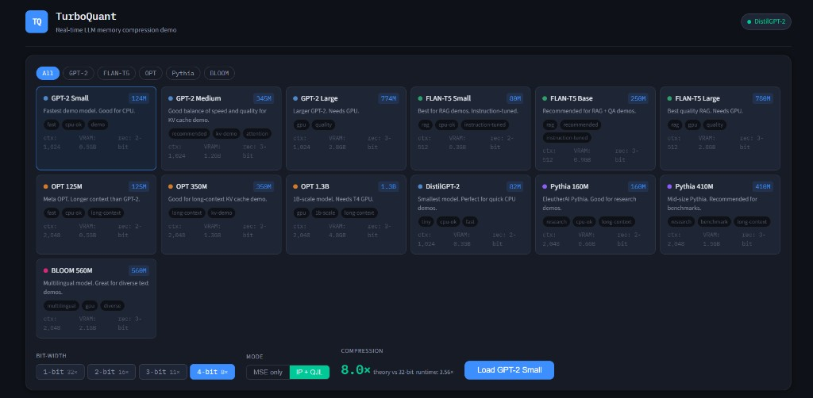
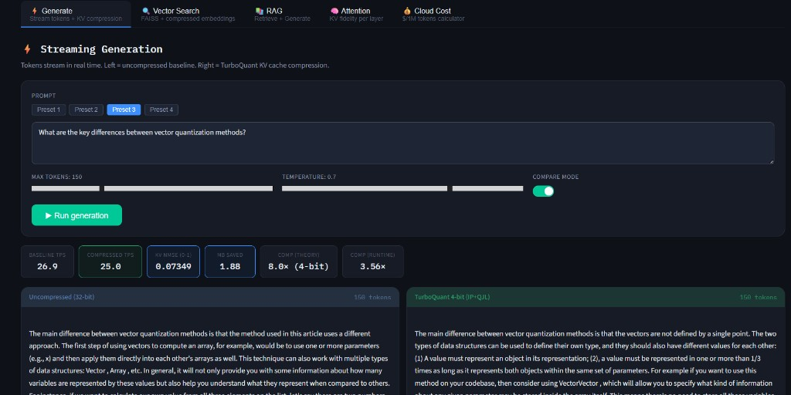
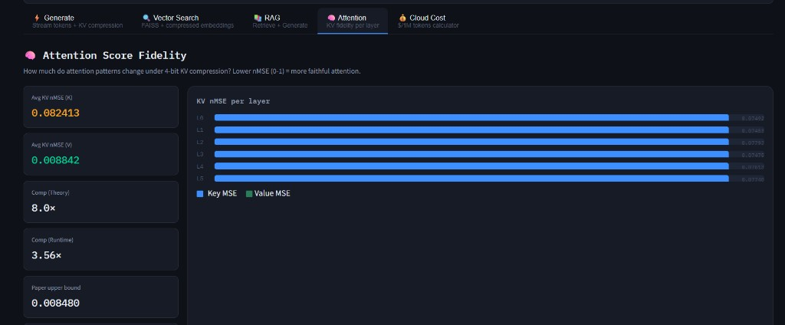

# TurboQuant Demo
**Production-style TurboQuant playground for LLM KV cache compression**

[](https://arxiv.org/abs/2504.19874)


[](./LICENSE)

**Quick Links:** [API Docs](http://localhost:8000/docs) · [Frontend](http://localhost:5173) · `cd backend && python smoke_test.py` · [Validation Notebook](./TurboQuant_Validation_Notebook.ipynb) · [GPU Enhanced Notebook](./TurboQuant_GPU_Enhanced.ipynb)

Real-time, full-stack demo of [TurboQuant (arXiv:2504.19874)](https://arxiv.org/abs/2504.19874) with:
- FastAPI backend for model loading, generation, retrieval, and live metrics
- React frontend with side-by-side baseline vs compressed outputs
- Streamed attention/KV fidelity telemetry and compression economics

## Why this project matters

Large language model inference is memory-bound. KV cache growth directly limits throughput, context length, and cost. TurboQuant addresses this by compressing cache vectors while preserving quality-critical signals.

This repo turns that theory into an interactive system you can run locally and inspect end-to-end.

## Features

- **Streaming generation:** baseline and compressed runs in one UI
- **Live KV quality telemetry:** K/V nMSE, per-layer error, compression latency
- **Vector search demo:** compressed embedding recall and latency
- **RAG demo:** compressed retrieval + generation flow
- **Cost calculator:** practical throughput/cost impact under different bit-widths
- **Dual compression metrics:** theory (`32 / bits`) and effective runtime ratio

## Quick start

### 1) Clone/open repository

Open `TurboQuant_demo/` in Cursor or your editor.

### 2) Start backend

```bash
cd backend
python -m venv venv
# Windows:
venv\Scripts\activate
# macOS/Linux:
# source venv/bin/activate
pip install -r requirements.txt
uvicorn main:app --reload --port 8000
```

Backend docs: [http://localhost:8000/docs](http://localhost:8000/docs)

### 3) Start frontend

```bash
cd frontend
npm install
npm run dev
```

Frontend: [http://localhost:5173](http://localhost:5173)

## Default runtime profile

- Default model in frontend: **GPT-2 Small (`gpt2`)**
- Default bit-width: **4-bit**
- Default mode: **IP + QJL**

These defaults are tuned for stable demo quality and low KV nMSE in local runs.

## Repository structure

```text
TurboQuant_demo/
├── backend/
│   ├── main.py                # FastAPI routes and request models
│   ├── turbo_engine.py        # Core compression, KV handling, generation logic
│   ├── model_registry.py      # Supported HuggingFace models
│   ├── metrics.py             # Lightweight metrics collector
│   └── smoke_test.py          # One-command backend smoke test
├── frontend/
│   ├── src/components/        # Model selector, live metrics strip
│   ├── src/pages/             # Generate, Attention, RAG, Vector, Cost demos
│   ├── src/store/modelStore.js# Zustand global state
│   └── src/lib/api.js         # REST + SSE + WebSocket client
├── TurboQuant_Validation_Notebook.ipynb
└── TurboQuant_GPU_Enhanced.ipynb
```

## TurboQuant in this implementation

At a high level:

1. Rotate vectors with a random orthogonal matrix
2. Quantize coordinates with Lloyd-Max codebooks
3. Apply QJL residual correction for inner-product fidelity (IP mode)

KV path used here:
- **K cache:** IP-aware TurboQuant (Polar + QJL)
- **V cache:** MSE-focused quantization

## Validation and smoke tests

Notebooks included:
- `TurboQuant_Validation_Notebook.ipynb` — CPU-focused theorem validation and plots
- `TurboQuant_GPU_Enhanced.ipynb` — GPU-enhanced validation workflow

Run full backend smoke suite:

```bash
cd backend
python smoke_test.py
```

Optional flags:

```bash
python smoke_test.py --max-new-tokens 8 --top-k 3 --bits 4
```

The suite covers:
- load/generate for causal and seq2seq models
- attention/per-layer metric population
- vector search
- RAG

## Tuning guide

- Increase bits (`3 -> 4`) to reduce nMSE
- Use `mse` mode when minimizing reconstruction error is primary
- Use `ip` mode when preserving similarity/attention behavior is primary
- For CPU demo stability, monitor `Compress ms` and choose moderate max tokens

## Add a new model

Add an entry in `backend/model_registry.py`:

```python
"my-model": ModelConfig(
    id="my-model",
    name="My Model Name",
    hf_id="org/model-name",
    params="1.5B",
    context_len=4096,
    vram_fp16_gb=6.0,
    task="causal-lm",  # or "seq2seq"
    family="MyFamily",
    description="Where this model is useful.",
    recommended_bits=4,
    tags=["demo", "long-context"],
)
```

## Environment

Frontend `.env`:

```bash
VITE_API_URL=http://localhost:8000
```

Backend:
- no required env vars for local usage
- optional: set `HF_HOME` for model cache location

## License

MIT

---
Built on TurboQuant research: *Near-Optimal Vector Quantization* (arXiv:2504.19874)

## UI Screenshots

### 1) Model selection + compression controls


### 2) Generate tab (baseline vs compressed outputs)


### 3) Attention score fidelity view

